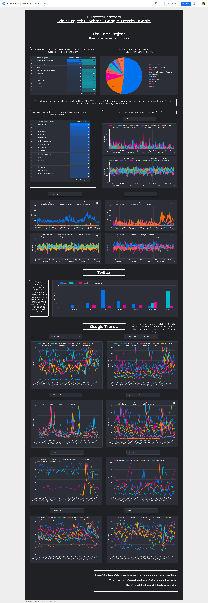
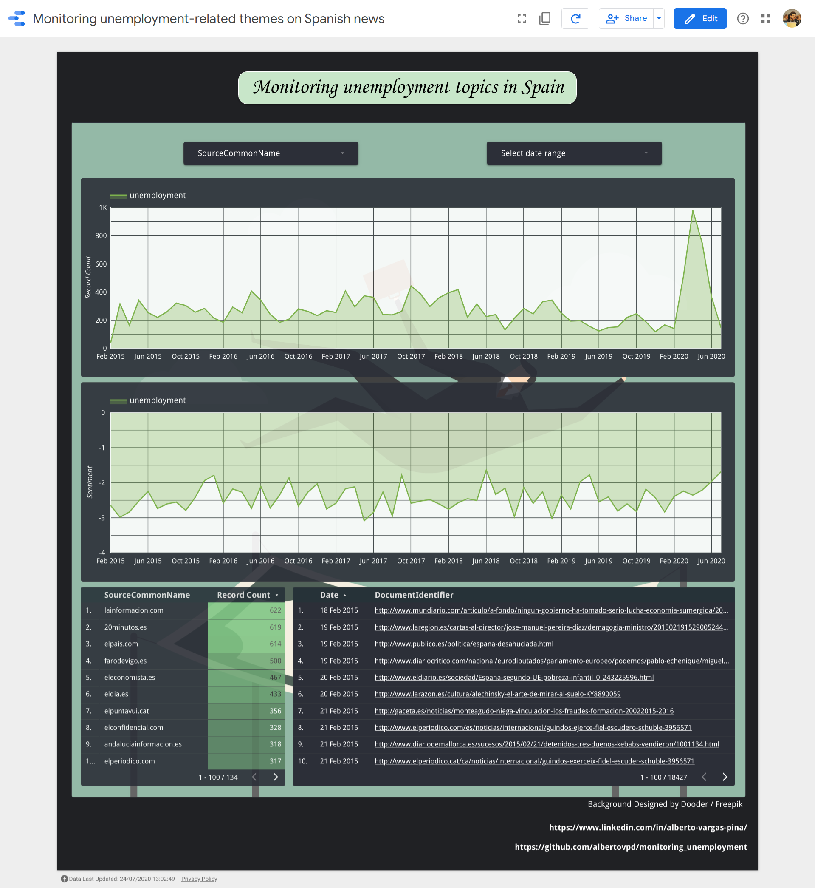
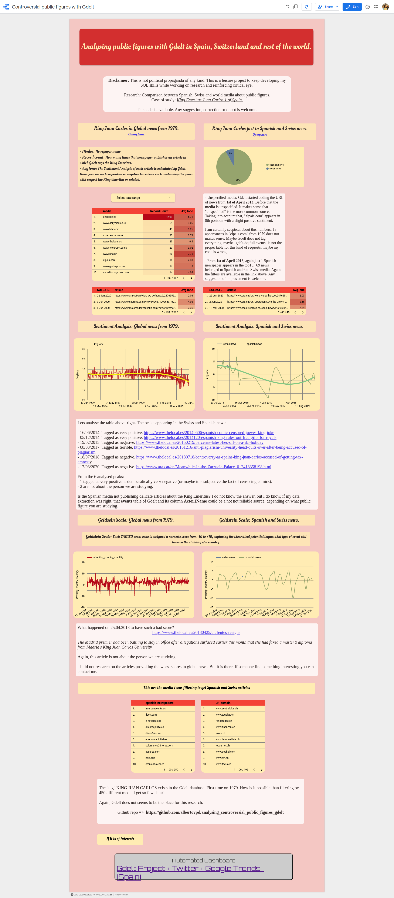

# Analysing world news with the Gdelt Project. 

Here I will be attaching all my Gdelt-related leisure projects. The list of projects briefly involves:
- Used tools and languages.
- Dashboard url.
- Repository url.
- Preview of each project (after the list).

The only one weekly automated is the first one (once I know by heart how to do it, there is no point on replicating it), nevertheless you can find instructions to automate the updates in all of them.

----------------------------------------------

**1. Socioeconomic Portrait Project.** 

- Automated ETL in Google Cloud Platform weekly updated, dashboarding.
- Python, SQL.
- Bigquery and the Gdelt Project, Google Trends.
- Dashboard => https://datastudio.google.com/reporting/755f3183-dd44-4073-804e-9f7d3d993315
- Repository => https://github.com/albertovpd/automated_etl_google_cloud-social_dashboard

**5. Automated ML regression within a Cloud Function to infer unemployment searches on Google, in Spain.**

- Automated ETL in Google Cloud Platform weekly updated, dashboarding.
- Python.
- Bigquery and the Gdelt Project, Google Trends.
- Dashboard => https://datastudio.google.com/s/m68cZQGKVpk
- Repository => https://github.com/albertovpd/automated_ML_regression

**2. Elon Musk influence in world news.**

- SQL, Bigquery, the Gdelt Project, dashboarding.
- Dashboard => https://datastudio.google.com/u/0/reporting/4578bcda-00a9-46e5-aacc-d773bfb360c2
- Repository => https://github.com/albertovpd/elon_musk_influence_in_news

**3. Monitoring unemployment in Spain.**

I really like this one. It is the most visual, it tells a story, and sources that feed the graphs are shown, you can navigate through them.

- SQL, Bigquery, the Gdelt Project, dashboarding.
- Dashboard => https://datastudio.google.com/u/1/reporting/a038e53e-ba0d-49a6-b8c9-6893445cc54a/page/UVSZB
- Repository => https://github.com/albertovpd/monitoring_unemployment

**4. Controversial public figures with Gdelt.**

- SQL, Bigquery, the Gdelt Project, dashboarding.
- Dashboard => https://datastudio.google.com/s/nShAIQD96fc
- Repository => https://github.com/albertovpd/analysing_controversial_public_figures_gdelt

**6. Gdelt project as marketing tool**

- SQL, Bigquery, the Gdelt Project, dashboarding.
- Dashboard => https://datastudio.google.com/reporting/f478f75f-6bf9-4d74-bc54-40e775c21f19
- Medium article => https://albertovpd.medium.com/biqquery-and-the-gdelt-project-beyond-dreams-of-marketing-analysts-62e586cc0343

--------------------------

# Socioeconomic Portrait Project. A Google Cloud ETL.

  
Click to expand

Is there a way of monitoring some aspects of the global crisis in Spain? I believe so, and this is the motivation to develop this automated **ETL** process in **Google Cloud** involving **Google Trends**, sentiment analysis and influence in news through **the Gdelt Project** and **Twitter**, from raw data acquisition to the final dashboard. Thanks to it, I have been fighting with credentials, permissions, storage locations, processing locations, 3rd party authentications, Cloud Functions, pipelines, trigger schedulers with different time format, Dataprep global updates, etc... And I learned a lot in the way, quaratine fun! :D

- Tools:
    - Cloud Function with Python script: Google Trends API
    - Weekly activated with Cloud Scheduler through Pub/Sub
    - Overwriting weekly a Cloud Storage file
    - Periodically appended to BigQuery with Dataprep
    - Modified with BigQuery and stored in different tables
    - Enriched with BigQuery through the Gdelt Project dataset
    - Visualized with Data Studio

- Dashboard => https://datastudio.google.com/reporting/755f3183-dd44-4073-804e-9f7d3d993315

- Repository => https://github.com/albertovpd/automated_etl_google_cloud-social_dashboard

It is worth mentioning the selector buttons are there just to have a clear picture of graphs. With them you can select the curves you want.

---------------------------------

# Automated ML regression within a Cloud Function to infer unemployment searches on Google, in Spain:

  
Click to expand

Taking advantage of this project ( https://github.com/albertovpd/automated_etl_google_cloud-social_dashboard ), i am using the gathered data to feed a ML model with which inferring unemployment searches on Google, in Spain.

+ Cloud Function A: Loads data from BigQuery tables to Cloud Storage, both in EEUU region. This tables contain requested and filtered info from the Gdelt Project, to analyse online news media in Spain (news section in the automated ETL link).

- Cloud Function B: 
  - Reads the data of Cloud Function A, and other data from a bucket in EU. This bucket contains requested info from Google Trends in Spain (Google searches section in the automated ETL link).
  - Merges datasets with different length and dates.
  - Processes them and creates a column and score for each keyword.
  - Normalises the final dataset.
  - Associate date with index, but dates are not in the game, so a time series problem was turned into a linear regression one. Check it out the full script explanation here.
  - Performs a Recursive Feature Elimination to select the best 20 features of 130 I have to play with.
  - Apply a linear regression to infer my keyword, in this case, unemployment. 
  - Loads the results in a Cloud Storage bucket.

+ Both Cloud Functions are triggered by Pub/Sub and Scheduler. Scripts can be found here.

+ Weekly loaded to BigQuery tables with Transfer. Some results appended to the existing tables and some overwritten. 

+ Plot the BigQuery tables.

Explanation available here => https://github.com/albertovpd/automated_ML_regression/blob/master/script_explained.ipynb

-----------------------------------------

# Elon Musk influence in world news:

  
Click to expand

What the world media say about Elon Musk or his companies? That is the sentiment associated to his related news? What were the most positive and negative articles ever written about him? Let's check it out.

It has been really interesting to discover that "cheap clickbait webpages" are the ones mentioning more often Mr. Musk, even more than his own webpages like "teslamotors" or similar. In the end, he is a controversial public figure with always a really personal point of view.

Also interesting is the fact that the webpages I was expecting to see appears from under the 22th position, like *Forbes*, *New York Times*.

- Dashboard => https://datastudio.google.com/u/0/reporting/4578bcda-00a9-46e5-aacc-d773bfb360c2

- Repository => https://github.com/albertovpd/elon_musk_influence_in_news

-----------------------------

# Monitoring Unemployment

  
Click to expand

Everyone is afraid right now of a Global crisis like in 2008. Can we check how often is mentioned in national press unemployment-related topics, and compare nowadays results with the 2008 ones?

The answer: Yes
If we also want to check the involved articles: Just from 2015.

- Dashboard => https://datastudio.google.com/u/1/reporting/a038e53e-ba0d-49a6-b8c9-6893445cc54a/page/UVSZB

- Repository => https://github.com/albertovpd/monitoring_unemployment

------------

# Controversial public figures with Gdelt:

  
Click to expand

I like reading "alternative" sources, like reddit, *hackernews* or *meneame*, and once in a while I read some news about delicate matters involving the King Emeritus of Spain. This articles always express a deep frustration about how this news are not being published in his country.

So, the questions I am trying to answer are the following: 

Are the spanish news not publishing the same than the rest of world about the King Emeritus of Spain?

Do we have a method to impartially contrast it?

- Dashboard => https://datastudio.google.com/s/nShAIQD96fc

- Repository => https://github.com/albertovpd/analysing_controversial_public_figures_gdelt

------------------------------------

# Gdelt project as marketing tool.

  
Click to expand

Using the different sentiment analysis metrics provided by The Gdelt Project.

- Dashboard => https://datastudio.google.com/reporting/f478f75f-6bf9-4d74-bc54-40e775c21f19
- Medium article => https://albertovpd.medium.com/biqquery-and-the-gdelt-project-beyond-dreams-of-marketing-analysts-62e586cc0343

Query:

    SELECT
      EXTRACT (date
      FROM
          PARSE_TIMESTAMP('%Y%m%d%H%M%S',CAST(date AS string))) AS Date,
      CAST(SPLIT(V2Tone, ",") [
      OFFSET
          (0)] AS FLOAT64) AS tone,
      CAST(SPLIT(V2Tone, ",") [
      OFFSET
          (1)] AS FLOAT64) AS pos_score,
      CAST(SPLIT(V2Tone, ",") [
      OFFSET
          (2)] AS FLOAT64) AS neg_score,
      CAST(SPLIT(V2Tone, ",") [
      OFFSET
          (3)] AS FLOAT64) AS polarity,
      CAST(SPLIT(V2Tone, ",") [
      OFFSET
          (4)] AS FLOAT64) AS arf,
      CAST(SPLIT(V2Tone, ",") [
      OFFSET
          (5)] AS FLOAT64) AS sg_rf,
      CAST(SPLIT(V2Tone, ",") [
      OFFSET
          (6)] AS FLOAT64) AS wc
      FROM
      `gdelt-bq.gdeltv2.gkg_partitioned`
      WHERE
      DATE(_PARTITIONTIME) >= "2018-01-01"
      AND lower(DocumentIdentifier) LIKE '%ironhack%'
    
*If you are going to display results in Data Studio, always save the query in a BigQuery table and display that results.*

----------------------------------------
------------

Alberto Vargas. 
- **https://www.linkedin.com/in/alberto-vargas-pina/**